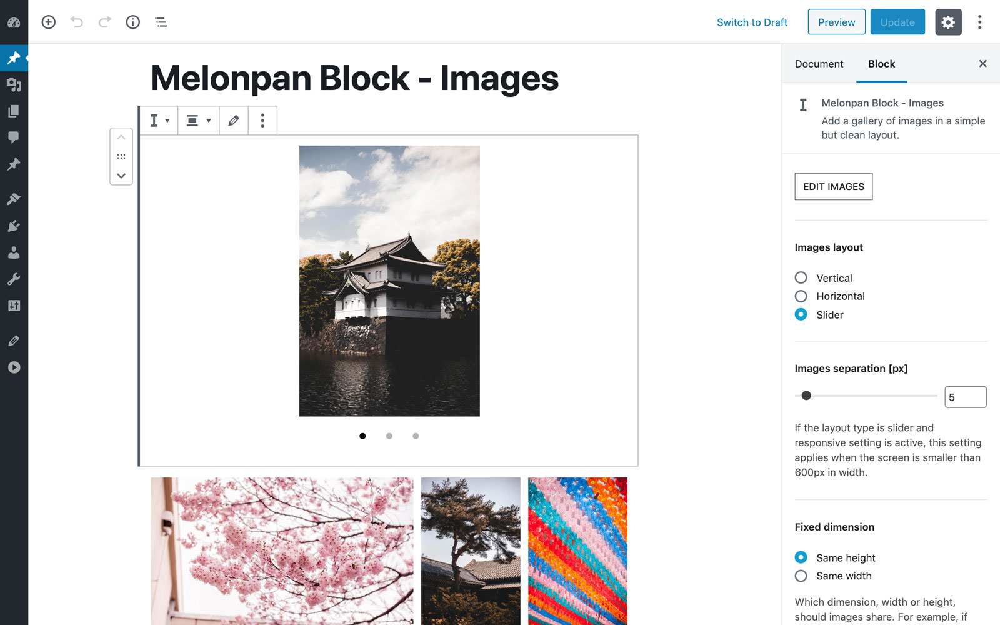

# Melonpan Block - Images

[Demo](https://gutenberg-showcase.melonpan.io/melonpan-block-images) - [Documentation](https://melonpan.io/gutenberg-blocks/melonpan-block-images) - [WordPress](https://wordpress.org/plugins/melonpan-block-images)

 

Add a gallery of images in a simple but clean layout.

 

## Features

The block comes with the following settings:

- Layout Vertical, Horizontal, Slider
- Images separation
- Cover size with aspect ratio
- Responsive property
- Fixed dimension for Horizontal and Slider layouts
- Slider dot color

Simple but created to be useful. Each image is rendered with the srcset property containing all sizes available. No scripts are added in the front-end.

 

## Screenshots

